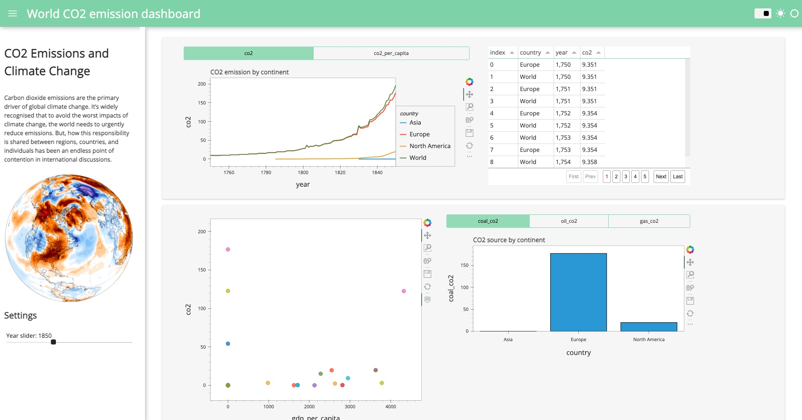

# ClimateChangeDataAnalysis
# **CO2 Emission Data Analysis**

## **Overview**

This repository contains the analysis and visualization of CO2 emission data. The analysis aims to uncover insights and answer critical environmental and policy-related questions to inform decision-making processes.

## **Tools Used**

- **Python**: For data preprocessing and manipulation.
- Pandas and HvPlot: For Visualization.

## **Objectives and Key Questions**

The primary objective of this analysis is to extract actionable insights from the CO2 emission data. Some key questions addressed through the visualization include:

- How have global CO2 emissions changed over time?
- Which Region are the largest contributors to CO2 emissions?
- What are the trends in CO2 emissions by GDP per capita (e.g., transportation, industry, residential)?
- What are the CO2 emission trends over time per GDP per capita?

## **Insights from the Visualization**

The visualizations created in Power BI provided several key insights, including:

1. Europe has the highest co2 emission
2. Regions with GDP on the higher end tend to have smaller co2 emission deviation.
3. There has been a stark increase in the CO2 levels over the 5 year period cover in the data (particularly between 1800 - 1840).

## **How to Use This Repository**

1. **Power BI Dashboard**: Open the Power BI file (**`CO2EmissionDataAnalysis.pbix`**) to explore the interactive dashboard.
2. **Data Files**: Access the raw data files in the **`data`** directory to understand the dataset used for analysis.
3. **Documentation**: Refer to the **`documentation`** directory for detailed notes on data preprocessing, transformation, and the methodology used in the analysis.

## **Contributing**

If you have any suggestions or improvements, feel free to submit a pull request or open an issue. Contributions are welcome!

## **License**

This project is licensed under the MIT License. See the **`LICENSE`** file for details.

## **Contact**

For any questions or inquiries, please contact babasoladuduyemi04@gmail.com.

---

By providing a comprehensive overview of the CO2 emission data analysis process and the insights derived from it, this README aims to guide users through the tools, data sources, key questions, and findings in a clear and structured manner.
